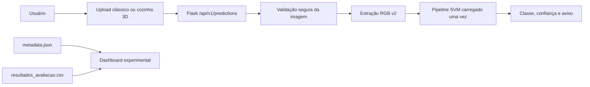
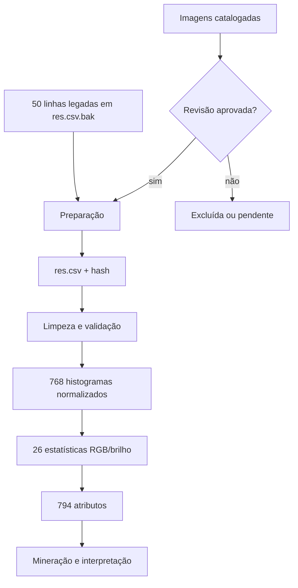
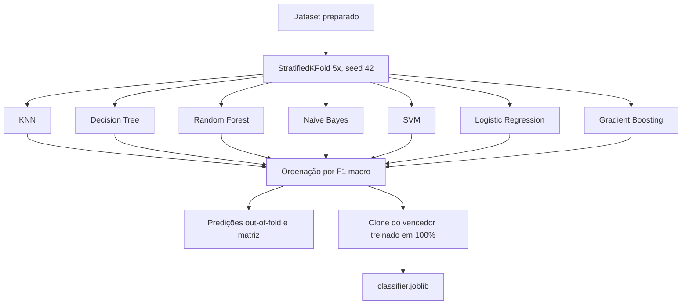
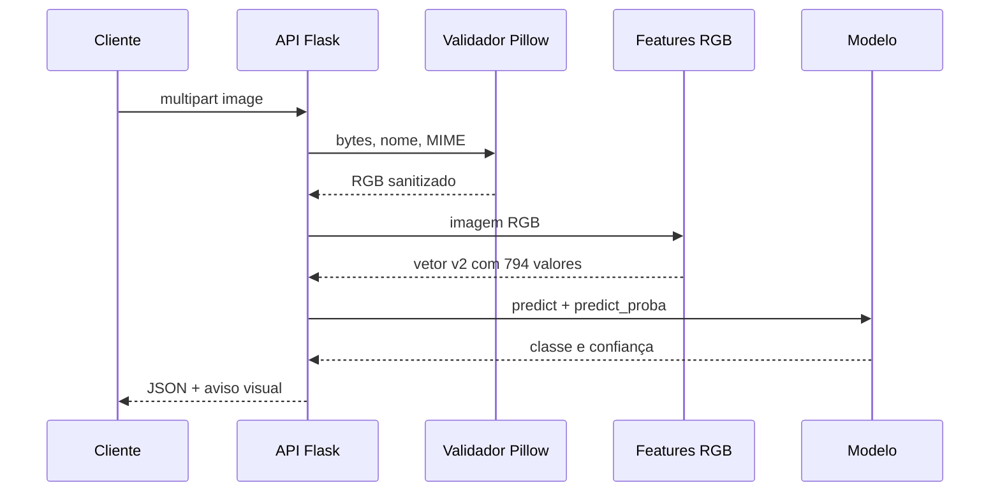
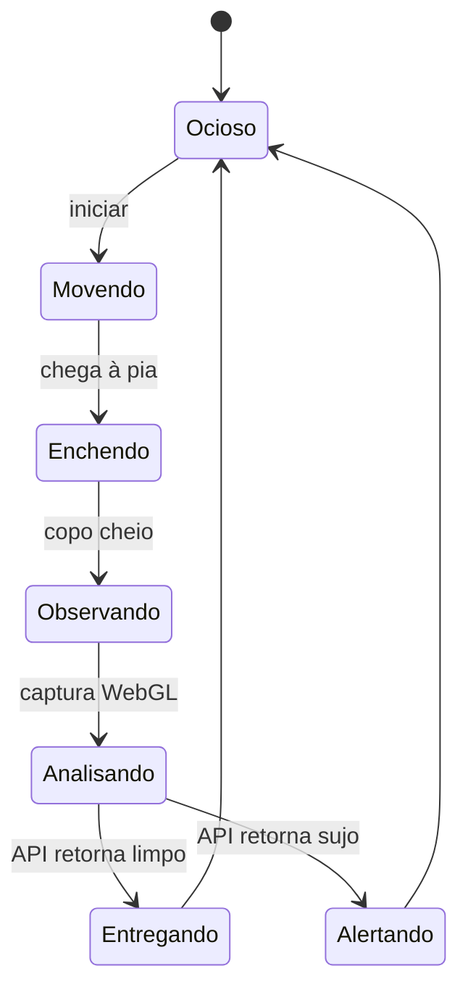
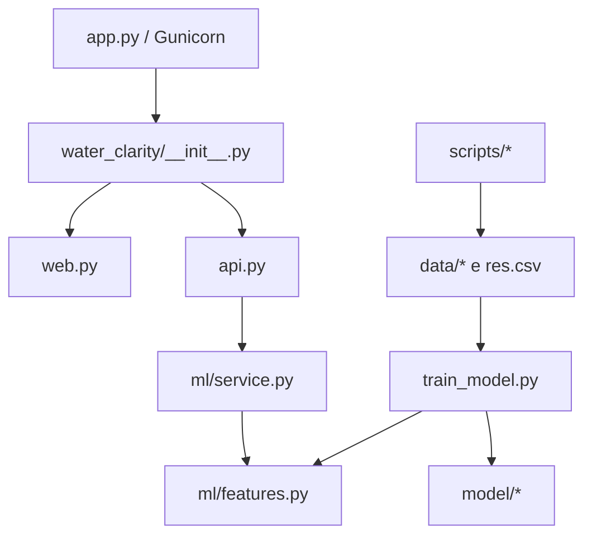

# Arquitetura

## Visão geral

A factory `water_clarity.create_app` registra dois blueprints: `web`, responsável por páginas e artefatos fixos, e `api`, responsável pelo contrato JSON. O serviço de ML carrega o artefato confiável de forma preguiçosa e segura entre threads.

## Pipeline KDD

## Treinamento e seleção

Escalonamento pertence ao `Pipeline` somente para modelos sensíveis à escala. Árvores recebem atributos sem `StandardScaler`. A avaliação nunca mede o modelo final já ajustado em todas as linhas.

## Fluxo de inferência

## Agente 3D

O seletor de aparência nunca envia o rótulo esperado. Ele altera o material da água; a cena é renderizada para PNG e a API decide com o mesmo modelo usado no upload clássico. Também é possível enviar uma fotografia própria no fluxo do agente.

## Organização

## Decisões e compromissos

- O domínio continua sendo RGB tradicional; não foi introduzida CNN nem serviço externo.
- O schema de atributos e o hash do dataset ficam junto do modelo para detectar divergências.
- Three.js está versionado localmente para funcionar com CSP estrita e sem CDN.
- O modelo serializado com Joblib deve ser tratado como executável confiável; o serviço nunca aceita modelos enviados pelo cliente.
- A aplicação não mantém sessão, conta ou banco de dados. Uploads são processados em memória e não são persistidos.
