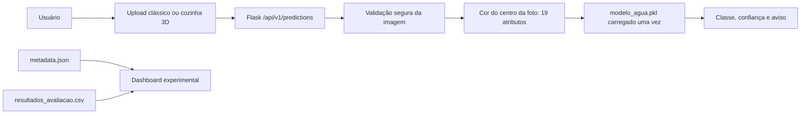
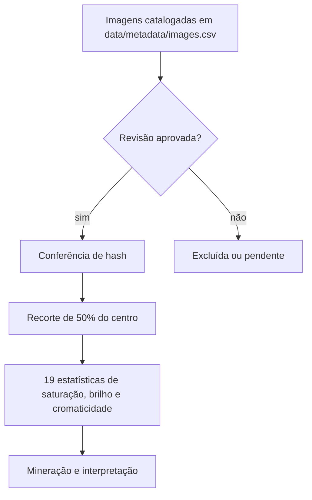
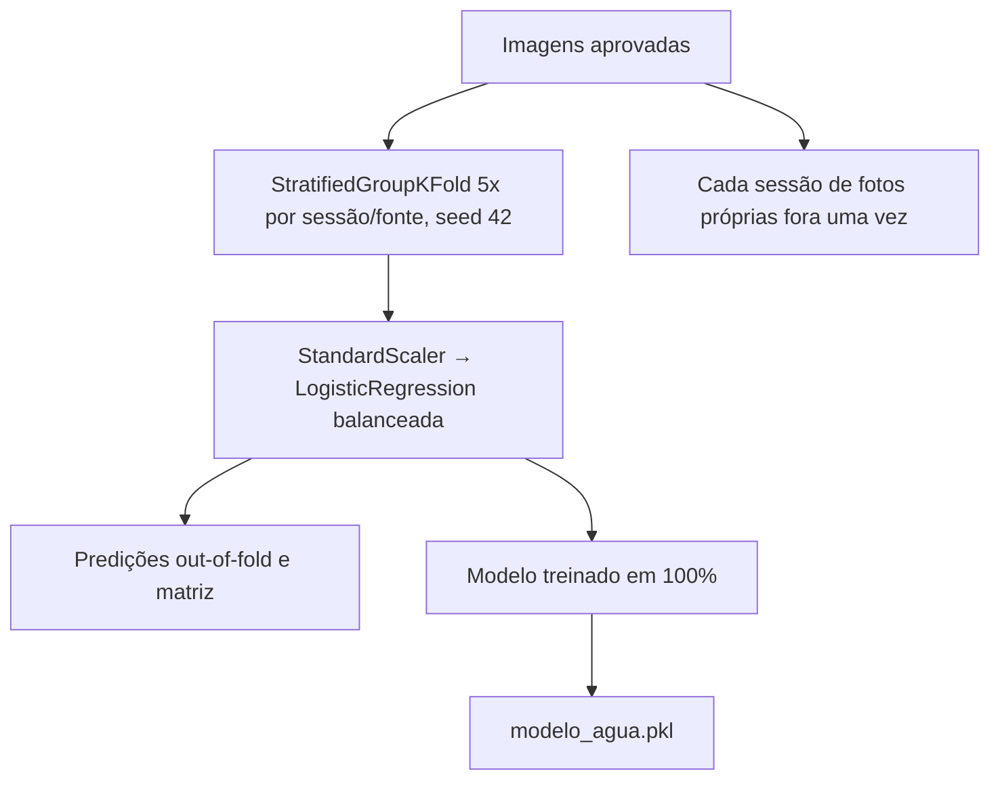
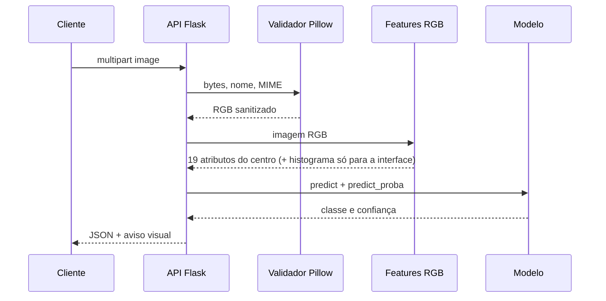
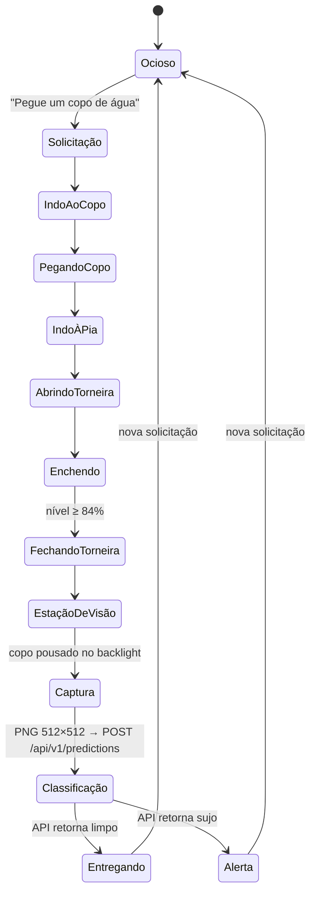
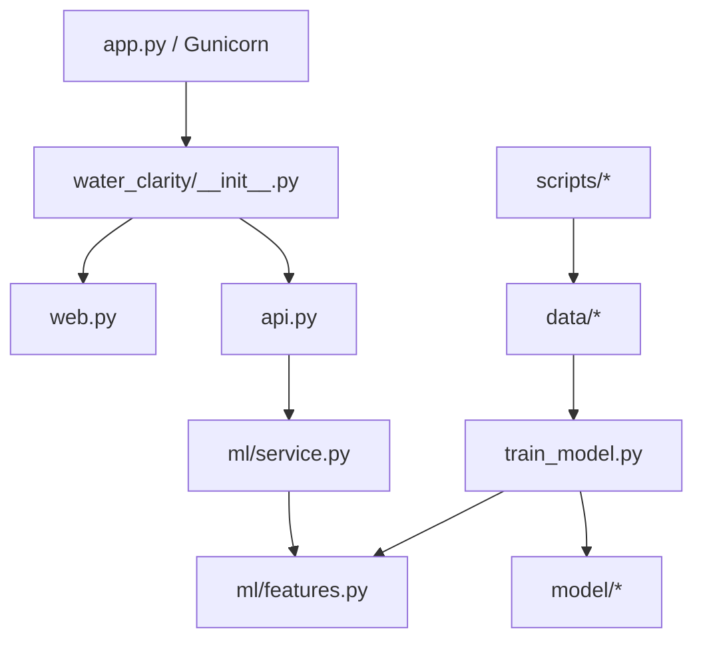

# Arquitetura

## Visão geral

A factory `water_clarity.create_app` registra dois blueprints: `web`, responsável por páginas e artefatos fixos, e `api`, responsável pelo contrato JSON. O serviço de ML carrega o artefato confiável de forma preguiçosa e segura entre threads.

## Pipeline KDD

## Treinamento e seleção

`train_model.py` treina apenas o `modelo_agua`. A avaliação nunca mede o modelo final já ajustado em todas as linhas.

## Fluxo de inferência

## Agente 3D (Water Vision)

Módulos em `static/js/experience/` (ES modules nativos, carregados só após "Iniciar experiência"):

| Módulo | Responsabilidade |
|---|---|
| `main.js` | interface (intro, carregamento por etapas reais, HUD, assistente, análise, resultado, diálogo) e chamada à API |
| `world.js` | renderer, qualidade adaptativa (baixa/média/alta/auto por dispositivo e FPS), loop e captura |
| `director.js` | máquina de estados da tarefa; sincroniza robô, câmera, torneira e interface |
| `robot.js` | robô, IK analítico de dois segmentos, olhar, piscar, gestos e status |
| `kitchen.js` / `environment.js` / `textures.js` | cozinha em metros, IBL procedural e texturas geradas |
| `glass.js` / `stream.js` | copo, água com transmissão física, fluxo com gravidade, respingos e bolhas |
| `camera.js` | planos cinematográficos amortecidos e modo livre (órbita por mouse, toque e teclado) |
| `anim.js` / `audio.js` | tweens no relógio da cena (aceleráveis) e áudio sintetizado opcional |

**Separação entre aparência e decisão.** O seletor "Água da torneira" altera apenas o material renderizado. A câmera fixa da estação de visão (fundo com backlight, como em inspeção de líquidos) renderiza sempre 512×512 com pixel ratio 1 — independentemente da qualidade gráfica — e o PNG segue para o mesmo endpoint do upload. Nenhum rótulo é enviado. O modo "Minha foto" envia a fotografia do usuário no lugar da captura.

**Limitação observada do modelo atual.** O modelo olha a cor do centro da foto; ele ainda confunde água suja clara ou leitosa com limpa e depende de o copo estar no centro do enquadramento. A demonstração mostra o resultado real; para o cenário de alerta use o modo "Minha foto" com uma imagem claramente suja (ex.: `data/raw/proprias/sujo/sujo19.jpg`).

## Organização

## Decisões e compromissos

- O domínio continua sendo RGB tradicional; não foi introduzida CNN nem serviço externo.
- O schema de atributos e o hash do dataset ficam junto do modelo para detectar divergências.
- Three.js, addons, fontes e texturas são locais ou procedurais para funcionar com CSP estrita e sem CDN (ver `docs/ASSETS.md`).
- O modelo serializado com Joblib deve ser tratado como executável confiável; o serviço nunca aceita modelos enviados pelo cliente.
- A aplicação não mantém sessão, conta ou banco de dados. Uploads são processados em memória e não são persistidos.
